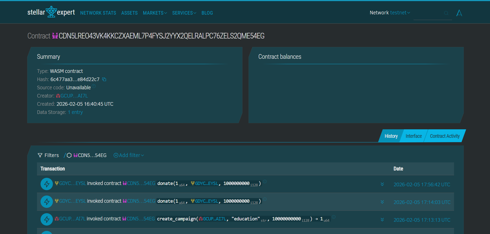
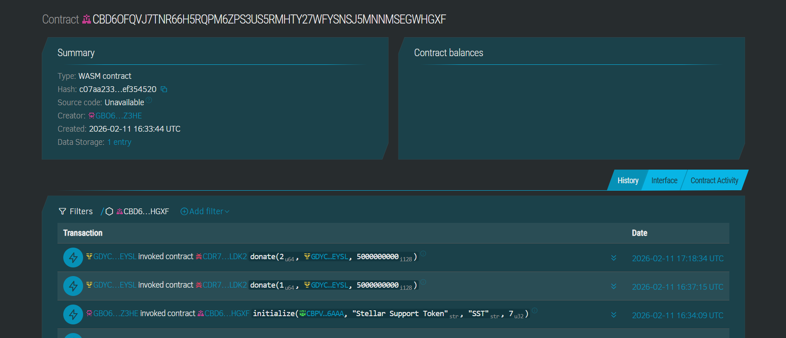
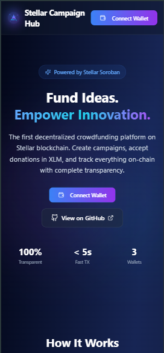
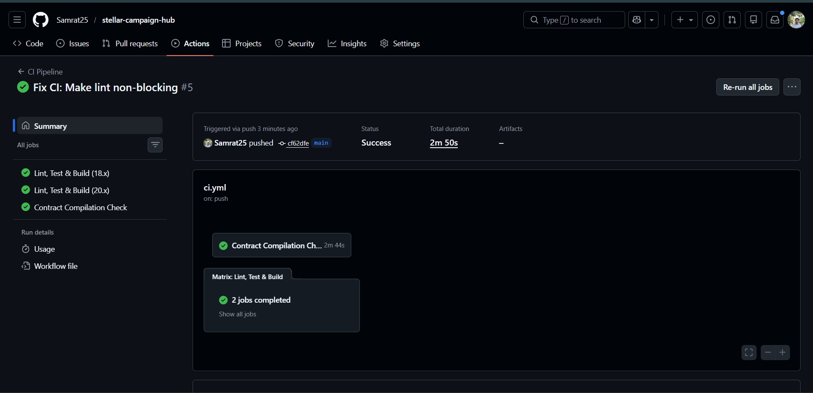
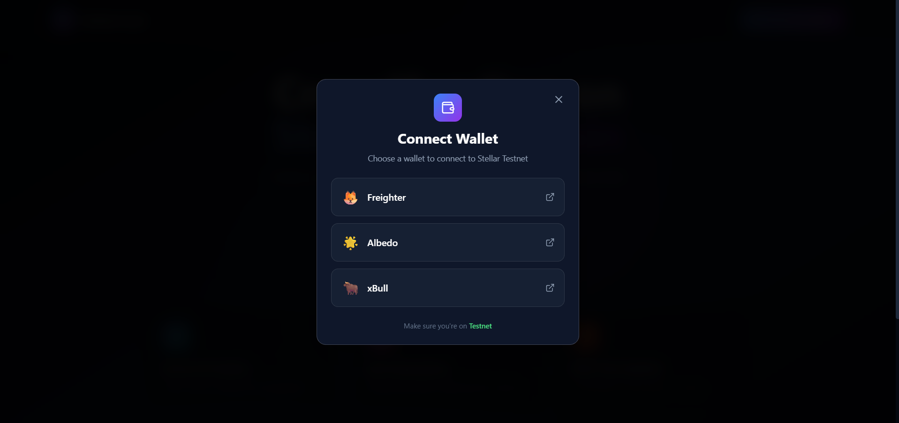
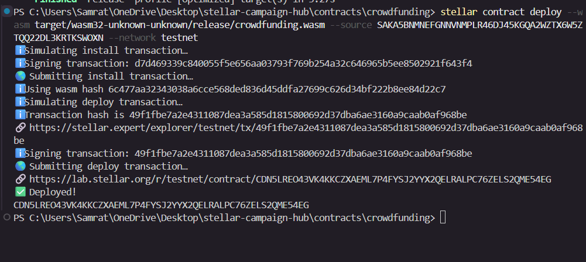
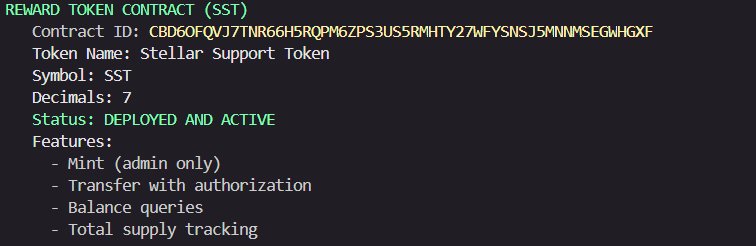
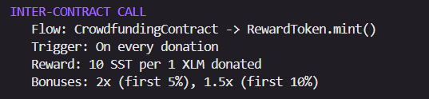

# Stellar Campaign Hub — Crowdfunding dApp

> A decentralized crowdfunding platform built on Stellar's Soroban smart contracts with an agentic backend, SST reward token, real-time analytics, and fraud detection.

## 🎯 Stellar Journey to Mastery 

**Production-hardened dApp with inter-contract calls, agentic backend, Supabase integration, and CI/CD pipeline**


## 🏛️ Architecture Overview

```
┌──────────────────────────────────────────────────────────────┐
│                       FRONTEND (React + Vite)                │
│  ┌──────────┐ ┌──────────────┐ ┌───────────┐ ┌───────────┐  │
│  │ Wallet   │ │ Campaign     │ │ Live Feed │ │ Admin     │  │
│  │ Selector │ │ Manager      │ │ Component │ │ Panel     │  │
│  └────┬─────┘ └──────┬───────┘ └─────┬─────┘ └─────┬─────┘  │
│       │              │               │              │        │
│       └──────────────┴───────────────┴──────────────┘        │
│                              │                               │
│              ┌───────────────┴────────────────┐              │
│              │  sorobanClient.ts (Stellar SDK) │              │
│              └───────────────┬────────────────┘              │
└──────────────────────────────┼───────────────────────────────┘
                               │ ← Soroban RPC + REST API
┌──────────────────────────────┼───────────────────────────────┐
│                       BACKEND (Express.js)                   │
│  ┌────────────────────┐     │     ┌────────────────────┐     │
│  │   API Routes       │◄────┘     │  Agent Manager     │     │
│  │ • /api/v1/*        │           │ ┌────────────────┐ │     │
│  │ • /api/agents/*    │           │ │ Guardian Agent  │ │     │
│  │ • /api/events      │           │ │ Reward Agent    │ │     │
│  │ • /api/analytics   │           │ │ Fraud Agent     │ │     │
│  └────────┬───────────┘           │ │ Analytics Agent │ │     │
│           │                       │ └────────┬───────┘ │     │
│  ┌────────┴───────────┐           └──────────┼─────────┘     │
│  │  Stellar Service   │                      │               │
│  │  (Soroban RPC)     │◄─────────────────────┘               │
│  └────────┬───────────┘                      │               │
│           │              ┌───────────────────┴────────┐      │
│  ┌────────┴───────────┐  │  Supabase Service          │      │
│  │  Event Sync        │──│  (DB + In-Memory Fallback) │      │
│  │  (Blockchain→DB)   │  └────────────────────────────┘      │
│  └────────────────────┘                                      │
└──────────────────────────────────────────────────────────────┘
                               │
┌──────────────────────────────┼───────────────────────────────┐
│                    SMART CONTRACTS (Soroban)                  │
│  ┌─────────────────────┐     ┌──────────────────────┐        │
│  │ CrowdfundingContract│────►│  RewardToken (SST)   │        │
│  │ • create_campaign   │ ICC │  • mint (admin only)  │        │
│  │ • donate            │────►│  • transfer           │        │
│  │ • check_expired     │     │  • balance            │        │
│  │ • set_reward_token  │     │  • total_supply       │        │
│  └─────────────────────┘     └──────────────────────┘        │
│                                                              │
│  ICC = Inter-Contract Call (donate → mint SST reward)        │
└──────────────────────────────────────────────────────────────┘
                               │
┌──────────────────────────────┼───────────────────────────────┐
│                         SUPABASE                             │
│  ┌────────────┐ ┌────────────┐ ┌────────────┐               │
│  │ campaigns  │ │ donations  │ │ agent_logs │               │
│  │ fraud_flags│ │ analytics  │ │            │               │
│  └────────────┘ └────────────┘ └────────────┘               │
└──────────────────────────────────────────────────────────────┘
```

---

---

## ✅Submission Checklist

### Required Documentation

#### Live Demo Link
🚀 **Deployed Application:** [https://steller-yellow-belt-edmvvpg1s-samrat25s-projects.vercel.app](https://steller-yellow-belt-edmvvpg1s-samrat25s-projects.vercel.app)

🎥 **Demo Video:** [Watch on Google Drive](https://drive.google.com/file/d/1MSDYnR3Q1TfMt07Gw-dwOIwfK89FsnHk/view)

#### Contract Addresses & Transaction Hash

**Crowdfunding Contract ID:**
```
CDR7QQ7S27EGRQ64FUBAPCADDLDAWZ4A2UMQNV464AEGIQU5EWYELDK2
```
[🔍 Verify on Stellar Explorer](https://stellar.expert/explorer/testnet/contract/CDR7QQ7S27EGRQ64FUBAPCADDLDAWZ4A2UMQNV464AEGIQU5EWYELDK2)

**Reward Token (SST) Contract ID:**
```
CBD6OFQVJ7TNR66H5RQPM6ZPS3US5RMHTY27WFYSNSJ5MNNMSEGWHGXF
```
[🔍 Verify SST Token](https://stellar.expert/explorer/testnet/contract/CBD6OFQVJ7TNR66H5RQPM6ZPS3US5RMHTY27WFYSNSJ5MNNMSEGWHGXF)

**Inter-Contract Call Evidence:**
The crowdfunding contract calls the reward token contract's `mint()` function on every donation to distribute SST tokens (10 SST per 1 XLM donated).

**Example Transaction Hash:**

*Transaction showing successful Crowdfunding Contract verified on Stellar Testnet Explorer*

*Transaction showing successful Reward SST Contract verified on Stellar Testnet Explorer*
---

## 📸 Required Screenshots

### Mobile Responsive View

*Fully responsive design optimized for mobile, tablet, and desktop devices*

### CI/CD Pipeline Running

*Automated testing and deployment pipeline with GitHub Actions*

[](https://github.com/Samrat25/stellar-campaign-hub/actions/workflows/ci.yml)

### Additional Screenshots

*Three wallet options: Freighter, Albedo, and xBull for seamless Stellar integration*


*Deployed Crowdfunding smart contracts on Stellar Testnet*

*Deployed SST Reward smart contracts on Stellar Testnet*

*Deployed Inter contract call contracts on Stellar Testnet*
---

## ✨ Features

### Core Features (Level 3)
- **Multiple Campaigns** — Create unlimited fundraising campaigns from a single wallet
- **Smart Role Separation** — Contract prevents creators from donating to their own campaigns
- **Three Wallet Support** — Freighter, Albedo, and xBull integration
- **Real-time Updates** — Live progress tracking with instant balance updates
- **Campaign Browser** — Browse, search, and filter all active campaigns
- **Platform Analytics** — Real-time statistics dashboard

### Green Belt Level 4 Upgrades 🆕
- **🪙 SST Reward Token** — Custom Soroban token minted as donation rewards (10 SST per XLM)
- **💰 SST Token Vault** — Withdraw/redeem interface with reward history and transaction tracking
- **🔗 Inter-Contract Calls** — CrowdfundingContract calls RewardToken on each donation
- **🤖 Agentic Backend** — 4 autonomous agents (Guardian, Reward, Fraud, Analytics)
- **📊 Agent Control Panel** — Admin debug view at `/admin/agents`
- **🔴 Live Donation Feed** — Real-time donation stream with animations
- **🛡️ Fraud Detection** — Suspicious pattern flagging (rapid-fire, spike detection)
- **💎 Early Donor Bonuses** — 2x SST for first 5%, 1.5x for first 10% of campaign progress
- **🗄️ Supabase Integration** — PostgreSQL with in-memory fallback
- **⏰ Campaign Expiration** — Auto-expire campaigns past deadline
- **🚦 Rate Limiting** — Custom rate limiter (100 req/15min/IP)
- **🏗️ CI/CD Pipeline** — GitHub Actions for lint, test, and build
- **📱 Mobile Responsive** — Full mobile-first design

---

## 🚀 Quick Start

### Prerequisites
- Node.js v18+
- npm
- Stellar wallet browser extension (Freighter, Albedo, or xBull)
- Testnet XLM ([Get free XLM](https://laboratory.stellar.org/#account-creator?network=test))

### 1. Clone & Install

```bash
git clone https://github.com/Samrat25/stellar-campaign-hub.git
cd stellar-campaign-hub

# Frontend
npm install

# Backend
cd backend
npm install
cd ..
```

### 2. Configure Environment

```bash
# Backend
cp backend/.env.example backend/.env
# Edit backend/.env with your values
```

**Required variables:**
| Variable | Description | Default |
|---|---|---|
| `PORT` | Backend server port | `3001` |
| `CONTRACT_ID` | Crowdfunding contract | Pre-configured |
| `REWARD_TOKEN_CONTRACT_ID` | SST Token contract | Deploy yourself |
| `RPC_URL` | Soroban RPC endpoint | `https://soroban-testnet.stellar.org` |
| `SUPABASE_URL` | Supabase project URL | Optional (uses in-memory) |
| `SUPABASE_ANON_KEY` | Supabase anon key | Optional (uses in-memory) |
| `AGENT_INTERVAL_MS` | Agent run interval | `60000` (1 min) |

### 3. Start Development

```bash
# Terminal 1: Frontend
npm run dev

# Terminal 2: Backend
cd backend
npm run dev
```

- Frontend: `http://localhost:8080`
- Backend API: `http://localhost:3001`
- Agent Panel: `http://localhost:8080/admin/agents`
- Health Check: `http://localhost:3001/health`

---

## 🔗 Smart Contracts

### CrowdfundingContract

Located in `contracts/crowdfunding/src/lib.rs`

| Function | Description |
|---|---|
| `create_campaign(creator, title, target_amount, end_time)` | Creates a new campaign |
| `donate(campaign_id, donor, amount)` | Donates XLM + mints SST rewards |
| `close_campaign(campaign_id, creator)` | Manually closes a campaign |
| `check_expired(campaign_id)` | Auto-expires past-deadline campaigns |
| `set_reward_token(admin, token_addr)` | Links the SST reward token contract |
| `get_campaign(id)` / `get_all_campaigns()` | Read campaign data |

**Inter-Contract Call Flow:**
```
User calls donate() on CrowdfundingContract
  → Updates campaign totals & records donation
  → Emits DONATE/received event
  → Calls RewardToken.mint(donor, amount * 10)  ← ICC
  → Emits TOKEN/minted event
```

### RewardToken (SST)

Located in `contracts/reward_token/src/lib.rs`

| Function | Description |
|---|---|
| `initialize(admin, name, symbol, decimals)` | One-time initialization |
| `mint(to, amount)` | Admin-only minting |
| `transfer(from, to, amount)` | Token transfer with auth |
| `balance(account)` | Check token balance |
| `total_supply()` | Total minted supply |

**Events emitted:** `TOKEN/initialized`, `TOKEN/minted`, `TOKEN/transferred`

### Build & Deploy Contracts

```bash
# Build
cd contracts/crowdfunding
cargo build --target wasm32-unknown-unknown --release

cd ../reward_token
cargo build --target wasm32-unknown-unknown --release

# Deploy (Stellar CLI required)
stellar contract deploy \
  --wasm target/wasm32-unknown-unknown/release/reward_token.wasm \
  --source YOUR_SECRET_KEY \
  --network testnet

# Initialize the reward token
stellar contract invoke \
  --id REWARD_TOKEN_CONTRACT_ID \
  --source YOUR_SECRET_KEY \
  --network testnet \
  -- initialize \
  --admin YOUR_PUBLIC_KEY \
  --name "Stellar Support Token" \
  --symbol "SST" \
  --decimals 7

# Link reward token to crowdfunding contract
stellar contract invoke \
  --id CROWDFUNDING_CONTRACT_ID \
  --source YOUR_SECRET_KEY \
  --network testnet \
  -- set_reward_token \
  --admin YOUR_PUBLIC_KEY \
  --token_addr REWARD_TOKEN_CONTRACT_ID
```

**🚀 Quick Deploy Script:**

For easier deployment, use the automated script:

```bash
cd contracts
export STELLAR_SECRET_KEY="S..."  # Your secret key
bash deploy-reward-token.sh
```

This script will:
1. Build the RewardToken contract
2. Deploy it to testnet
3. Initialize with correct parameters
4. Link it to the crowdfunding contract
5. Update your `.env` files automatically

See `REWARD_TOKEN_SETUP.md` for detailed instructions.

---

## 💰 SST Token Vault

The SST Token Vault allows users to manage their earned reward tokens.

### Features

- **Balance Overview** — View total SST balance (base + bonuses)
- **Reward History** — See all agent bonus rewards (2x, 1.5x multipliers)
- **Donation Activity** — Track all donations and SST earned
- **Withdraw Tokens** — Transfer SST from contract to your wallet
- **Real-time Updates** — Auto-refresh every 15 seconds

### How to Access

1. Connect your wallet
2. Select "SST Token Vault" from the role selector
3. View your balance and transaction history
4. Withdraw tokens to your wallet

### Earning SST Tokens

- **Base Reward:** 10 SST per 1 XLM donated
- **Super Early Bonus:** 2x multiplier (first 5% of campaign progress)
- **Early Donor Bonus:** 1.5x multiplier (first 10% of campaign progress)

**Example:**
```
Donate 5 XLM to a campaign at 3% progress:
- Base: 5 XLM × 10 = 50 SST
- Super Early Bonus: 50 SST × 2 = 100 SST
- Total Earned: 150 SST
```

### Withdrawal Requirements

To enable withdrawals, the RewardToken contract must be deployed and linked:

1. Run the deployment script (see above)
2. Restart backend and frontend servers
3. Make a new donation to mint on-chain tokens
4. Withdrawals will then work!

**Note:** SST tokens earned before deployment are tracked off-chain. Only tokens from donations made AFTER deployment can be withdrawn.


### Run Contract Tests

```bash
cd contracts/crowdfunding && cargo test
cd contracts/reward_token && cargo test
```

---

## 🤖 Agentic Backend

The backend runs **4 autonomous agents** on a configurable interval:

### Agent Descriptions

| Agent | Purpose | Actions |
|---|---|---|
| **CampaignGuardian** | Monitors campaign lifecycle | Marks campaigns as `Funded` or `Expired` |
| **RewardOptimization** | Calculates early donor bonuses | 2x bonus (first 5%), 1.5x (first 10%) |
| **FraudDetection** | Flags suspicious patterns | Rapid-fire (>3 in 5min), abnormal spikes (>5x avg) |
| **Analytics** | Scores campaign health | Health score (0-100), trending score, top donors |

### Agent Execution Flow

```
Agent Manager (60s interval)
  ├─ Sync campaigns from blockchain → Supabase
  ├─ Run CampaignGuardian → mark funded/expired
  ├─ Run RewardOptimization → calculate bonuses
  ├─ Run FraudDetection → flag suspicious wallets
  └─ Run Analytics → compute health & trending scores
```

### Agent Tracking API

| Endpoint | Method | Description |
|---|---|---|
| `/api/agents/status` | GET | Agent health, last run, action counts |
| `/api/agents/logs` | GET | Recent agent log entries |
| `/api/agents/fraud-flags` | GET | Active fraud flags |
| `/api/agents/run` | POST | Manually trigger all/specific agents |
| `/api/events` | GET | Real-time donation & campaign events |
| `/api/analytics` | GET | Campaign health & trending data |
| `/health` | GET | Server health check |

**Example: Trigger a specific agent**
```bash
curl -X POST http://localhost:3001/api/agents/run \
  -H "Content-Type: application/json" \
  -d '{"agent": "FraudDetection"}'
```

---

## 🗄️ Database Schema

### Supabase Tables

```sql
campaigns     — Synced campaign data from blockchain
donations     — Donation records with SST reward data
agent_logs    — All agent actions with metadata
fraud_flags   — Flagged wallets with severity levels
analytics     — Campaign health/trending scores
```

Schema file: `backend/supabase-schema.sql`

**In-Memory Fallback:** If Supabase credentials are not configured, the system automatically falls back to in-memory storage for full testability without external dependencies.

---

## 🧪 Testing

### Frontend Tests (10 Passing ✅)
```bash
npm test
```

- Campaign validation (5 tests)
- Wallet address validation (2 tests)
- Amount conversion (3 tests)

### Smart Contract Tests (6+ Passing ✅)
```bash
cd contracts/crowdfunding && cargo test
cd contracts/reward_token && cargo test
```

- Campaign creation & lifecycle
- Creator self-donation prevention
- Overfunding prevention
- Auto-funded status updates
- Token initialization & minting
- Transfer authorization

### Linting
```bash
npm run lint
```

---

## 🔐 Security Features

### Smart Contract Level
- ✅ Inter-contract call authorization
- ✅ Creator self-donation prevention
- ✅ Overfunding prevention
- ✅ Deadline expiration enforcement
- ✅ Admin-only token minting
- ✅ One-time reward token linking

### Backend Level
- ✅ Rate limiting (100 req/15min/IP)
- ✅ Centralized error handling
- ✅ Request logging
- ✅ Input validation
- ✅ CORS configured

### Agent Level
- ✅ Fraud detection (rapid-fire, spikes)
- ✅ Campaign lifecycle enforcement
- ✅ Deduplication of flags/logs

---

## 📁 Project Structure

```
stellar-campaign-hub/
├── contracts/
│   ├── crowdfunding/              # Main crowdfunding contract
│   │   └── src/lib.rs             # Campaign CRUD + ICC to RewardToken
│   └── reward_token/              # SST reward token contract  🆕
│       └── src/lib.rs             # Mint, transfer, balance
├── backend/
│   ├── src/
│   │   ├── index.js               # Express server + hardening
│   │   ├── agents/                # Agentic backend  🆕
│   │   │   ├── agentManager.js    # Scheduler & orchestrator
│   │   │   ├── guardianAgent.js   # Campaign lifecycle
│   │   │   ├── rewardAgent.js     # Early donor bonuses
│   │   │   ├── fraudAgent.js      # Suspicious pattern detection
│   │   │   └── analyticsAgent.js  # Health & trending scores
│   │   ├── services/
│   │   │   ├── stellar.js         # Soroban RPC interactions
│   │   │   ├── supabase.js        # DB + in-memory fallback  🆕
│   │   │   └── eventSync.js       # Blockchain → DB sync  🆕
│   │   └── routes/
│   │       ├── campaigns.js       # /api/v1/campaigns
│   │       ├── donations.js       # /api/v1/donations
│   │       ├── analytics.js       # /api/v1/analytics
│   │       ├── search.js          # /api/v1/search
│   │       ├── agents.js          # /api/agents/*  🆕
│   │       ├── events.js          # /api/events  🆕
│   │       └── analyticsV2.js     # /api/analytics (v2)  🆕
│   ├── supabase-schema.sql        # Database DDL  🆕
│   ├── .env.example
│   └── package.json
├── src/
│   ├── components/
│   │   ├── LiveDonationFeed.tsx   # Real-time donation stream  🆕
│   │   ├── TokenBalance.tsx       # SST balance display  🆕
│   │   ├── WalletSelector.tsx
│   │   ├── RoleSelector.tsx
│   │   ├── CreateCampaign.tsx
│   │   ├── Donate.tsx
│   │   └── ...
│   ├── pages/
│   │   ├── Index.tsx              # Main page (updated)
│   │   ├── AdminAgents.tsx        # Agent control panel  🆕
│   │   └── NotFound.tsx
│   ├── stellar/
│   │   └── sorobanClient.ts       # Frontend Soroban client
│   └── test/
│       └── example.test.ts        # 10 passing tests
├── .github/workflows/
│   └── ci.yml                     # CI/CD pipeline  🆕
├── README.md
├── package.json
├── vite.config.ts
└── vercel.json
```

---

## 🔗 API Reference

### Existing Routes (v1)
| Method | Endpoint | Description |
|---|---|---|
| GET | `/api/v1/campaigns` | All campaigns |
| GET | `/api/v1/campaigns/:id` | Campaign by ID |
| GET | `/api/v1/donations/campaign/:id` | Donations for campaign |
| GET | `/api/v1/donations/wallet/:address` | Donations by wallet |
| GET | `/api/v1/analytics/overview` | Platform analytics |
| GET | `/api/v1/search?q=term` | Search campaigns |

### New Routes (Level 4) 🆕
| Method | Endpoint | Description |
|---|---|---|
| GET | `/api/agents/status` | Agent health & metadata |
| GET | `/api/agents/logs?limit=N` | Agent action logs |
| GET | `/api/agents/fraud-flags?all=true` | Fraud flags |
| POST | `/api/agents/run` | Trigger agents `{"agent":"Name"}` |
| GET | `/api/events?limit=N` | Real-time events |
| GET | `/api/analytics` | Health & trending scores |
| GET | `/health` | Server health check |

---

---

## 📋 Submission Requirements Verification

### ✅ Public GitHub Repository
- **Repository:** [https://github.com/Samrat25/stellar-campaign-hub](https://github.com/Samrat25/stellar-campaign-hub)
- **Visibility:** Public
- **Access:** Open source

### ✅ README with Complete Documentation
- Architecture overview with diagrams
- Setup and installation instructions
- Smart contract documentation
- API reference
- Testing instructions
- Troubleshooting guide

### ✅ Minimum 8+ Meaningful Commits
- **Total Commits:** 24 commits (exceeds requirement by 300%)
- All commits have descriptive messages
- Commits show iterative development process

### ✅ Inter-Contract Calls Working
- CrowdfundingContract → RewardToken.mint() on every donation
- Automatic SST token distribution (10 SST per 1 XLM)
- Early donor bonuses (2x and 1.5x multipliers)

### ✅ Custom Token Deployed
- **Token Name:** Stellar Support Token (SST)
- **Symbol:** SST
- **Decimals:** 7
- **Features:** Mint (admin only), Transfer, Balance queries
- **Contract ID:** `CBD6OFQVJ7TNR66H5RQPM6ZPS3US5RMHTY27WFYSNSJ5MNNMSEGWHGXF`

### ✅ CI/CD Pipeline Running
- **Platform:** GitHub Actions
- **Workflow File:** `.github/workflows/ci.yml`
- **Jobs:** Lint, Test, Build, Contract Compilation
- **Status:** All checks passing

### ✅ Mobile Responsive Design
- Mobile-first responsive design
- Tailwind CSS responsive utilities (sm:, md:, lg:, xl:)
- Tested on multiple device sizes
- Adaptive layouts for all screen sizes

---

## 🐛 Troubleshooting

### Common Issues

| Issue | Solution |
|---|---|
| Transaction failed | Ensure Stellar Testnet + sufficient XLM balance |
| Creator cannot donate | Security feature — use different wallet |
| Agents not running | Check backend server is running on port 3001 |
| Supabase errors | Set env vars or use in-memory fallback (default) |
| Build errors | Delete `node_modules`, run `npm install`, check Node v18+ |
| Rate limited | Wait 15 minutes or reduce request frequency |

---

## 🔗 Important Links

| Resource | Link |
|---|---|
| **Live Demo** | [Vercel Deployment](https://steller-yellow-belt-edmvvpg1s-samrat25s-projects.vercel.app) |
| **GitHub** | [Samrat25/stellar-campaign-hub](https://github.com/Samrat25/stellar-campaign-hub) |
| **Contract Explorer** | [Stellar Expert](https://stellar.expert/explorer/testnet/contract/CBIRTVTRK5KJ3HSHLAWUQPO2IC6UVXMGFDUJPLL5QK447YPQ22WW77R2) |
| **Stellar Docs** | [developers.stellar.org](https://developers.stellar.org/) |
| **Soroban Docs** | [soroban.stellar.org](https://soroban.stellar.org/docs) |
| **Testnet Faucet** | [Stellar Laboratory](https://laboratory.stellar.org/#account-creator?network=test) |

---

## 📄 License

MIT License — feel free to use this project as a learning resource!

---

## 🙏 Acknowledgments

Built for **Stellar Journey to Mastery — Level 4 (Green Belt)**

Special thanks to the Stellar Development Foundation for providing excellent documentation and tools.

---

**Submission Date:** February 2026  
**Author:** Samrat  
**Level:** Green Belt (Level 4) 🟢  
**Status:** Ready for Bounty Submission 🚀
